# Architecture Documentation

> Comprehensive technical architecture for the Kotak Gold Loan Voice Agent

---

## Table of Contents

1. [System Overview](#system-overview)
2. [High-Level Architecture](#high-level-architecture)
3. [Voice Pipeline](#voice-pipeline)
4. [Plugin Architecture](#plugin-architecture)
5. [Conversation Flow](#conversation-flow)
6. [RAG System](#rag-system)
7. [Customer Personalization](#customer-personalization)
8. [Language Support](#language-support)
9. [Scalability & Performance](#scalability--performance)
10. [Extensibility Guide](#extensibility-guide)
11. [Deployment Options](#deployment-options)
12. [Production Readiness & Recommendations](#production-readiness--recommendations)

---

## System Overview

The Kotak Gold Loan Voice Agent is an **AI-powered multilingual voice assistant** designed to acquire gold loan customers from competitors. It combines:

- **Real-time voice processing** with sub-2-second latency
- **7+ Indian languages** with native-quality speech
- **Personalized conversations** based on customer segments
- **Knowledge-augmented responses** via RAG
- **Pluggable architecture** for easy provider switching

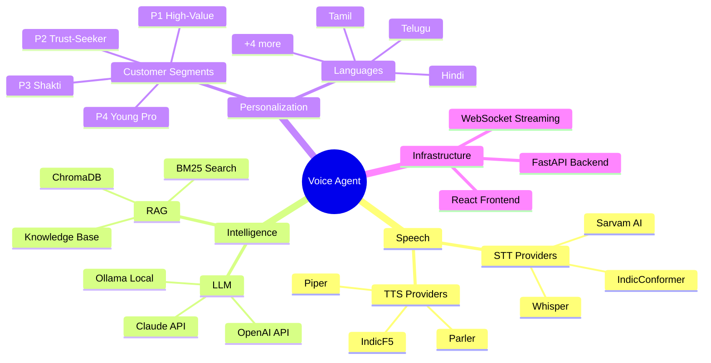

---

## High-Level Architecture

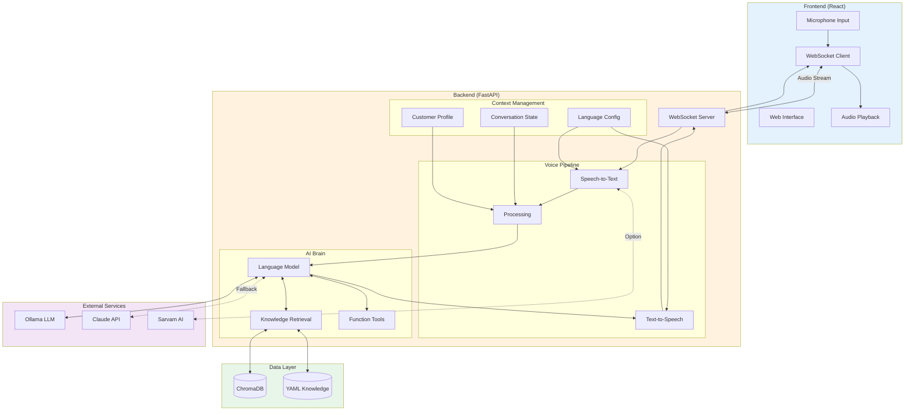

---

## Voice Pipeline

The voice pipeline processes audio in real-time with minimal latency:

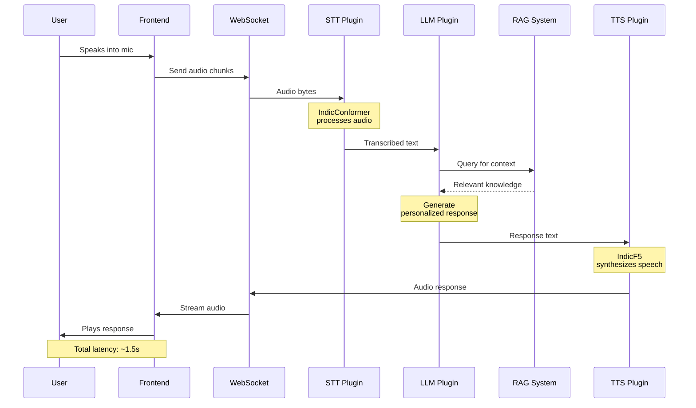

### Pipeline Stages

```mermaid
flowchart LR
    subgraph Input["Input Stage"]
        A1[Audio Capture]
        A2[Noise Reduction]
        A3[VAD Detection]
    end

    subgraph STT["STT Stage"]
        B1[Audio Preprocessing]
        B2[Model Inference]
        B3[Post-processing]
    end

    subgraph NLU["Understanding"]
        C1[Intent Detection]
        C2[Entity Extraction]
        C3[Context Merge]
    end

    subgraph Response["Response Generation"]
        D1[RAG Retrieval]
        D2[Prompt Construction]
        D3[LLM Generation]
    end

    subgraph TTS["TTS Stage"]
        E1[Text Normalization]
        E2[Prosody Planning]
        E3[Audio Synthesis]
    end

    subgraph Output["Output Stage"]
        F1[Audio Encoding]
        F2[Streaming]
    end

    A1 --> A2 --> A3 --> B1
    B1 --> B2 --> B3 --> C1
    C1 --> C2 --> C3 --> D1
    D1 --> D2 --> D3 --> E1
    E1 --> E2 --> E3 --> F1
    F1 --> F2

    style Input fill:#ffebee
    style STT fill:#e3f2fd
    style NLU fill:#fff3e0
    style Response fill:#f3e5f5
    style TTS fill:#e8f5e9
    style Output fill:#fce4ec
```

---

## Plugin Architecture

The system uses a **registry-based plugin architecture** for maximum flexibility:

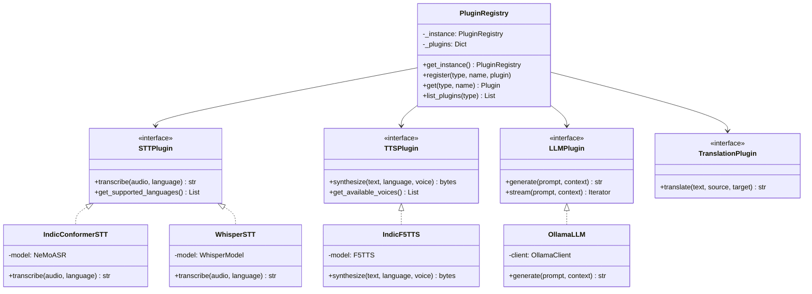

### Plugin Factory Pattern

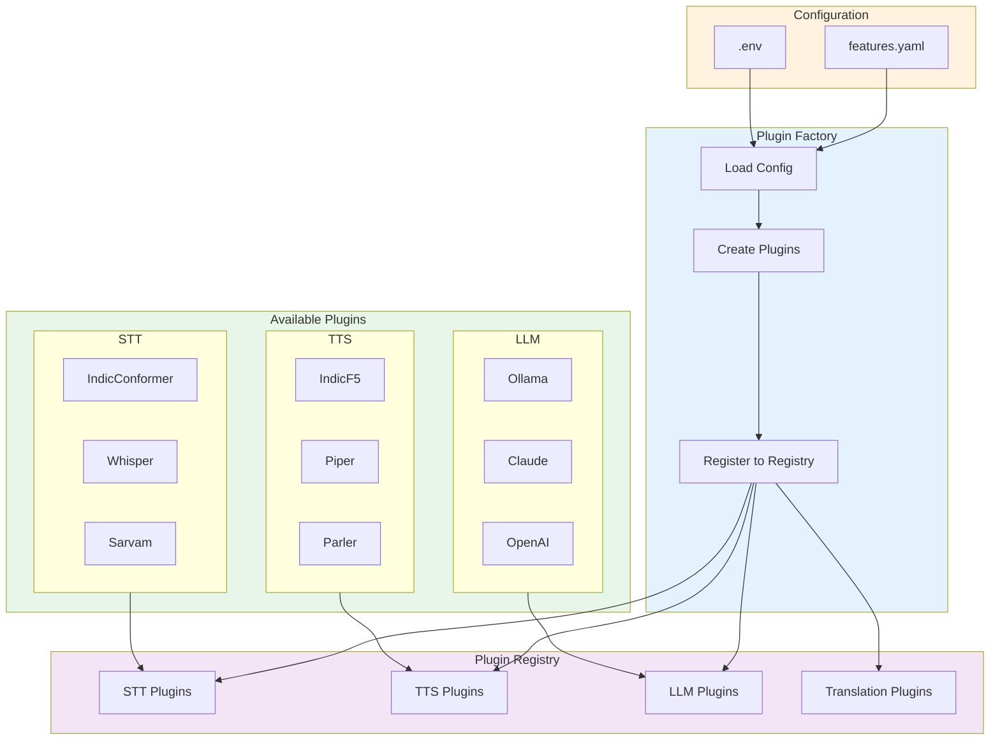

---

## Conversation Flow

### State Machine

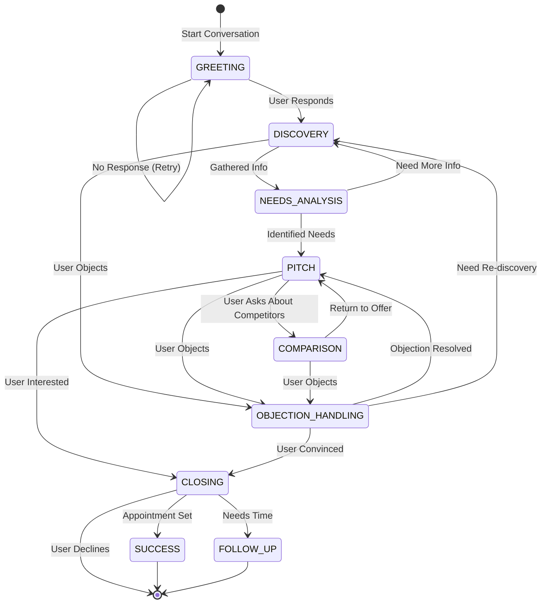

### Conversation Context Flow

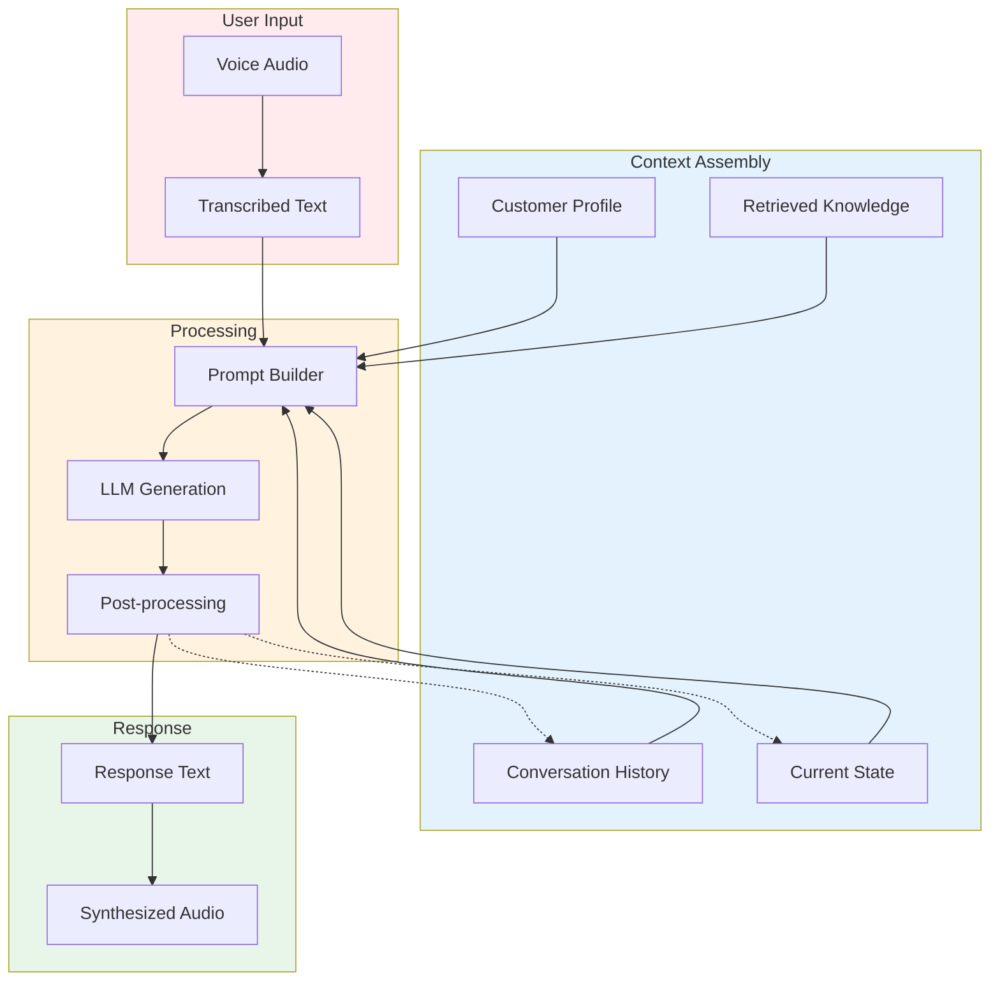

---

## RAG System

### Knowledge Retrieval Architecture

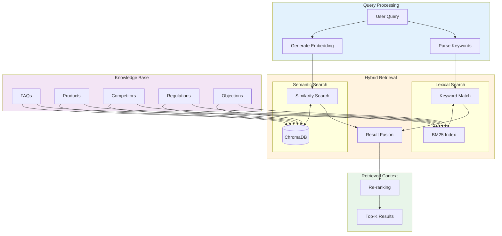

### Knowledge Categories

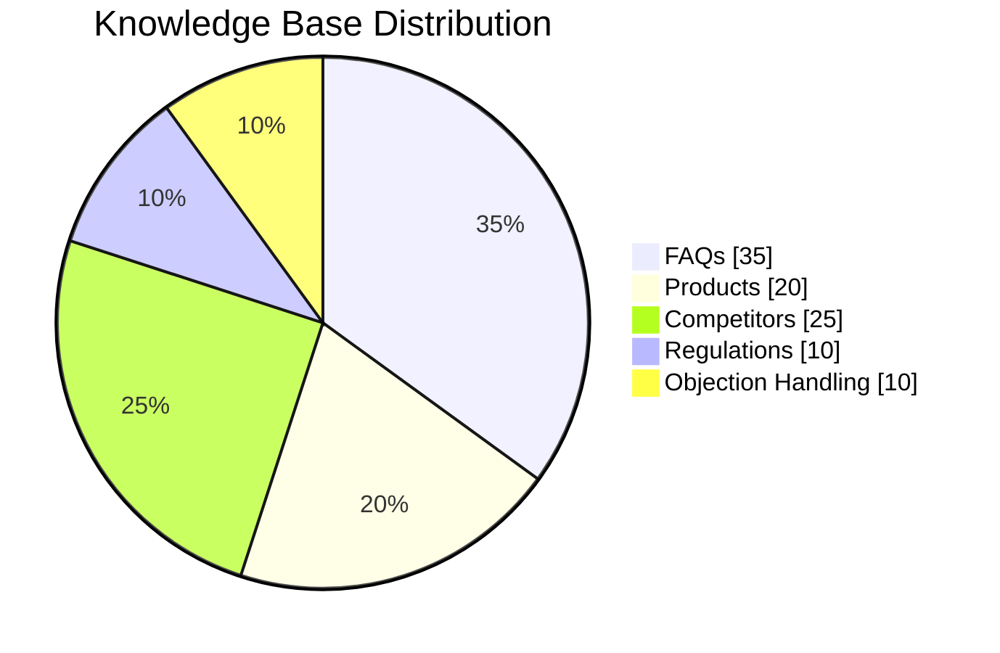

---

## Customer Personalization

### Segment-Based Personalization Flow

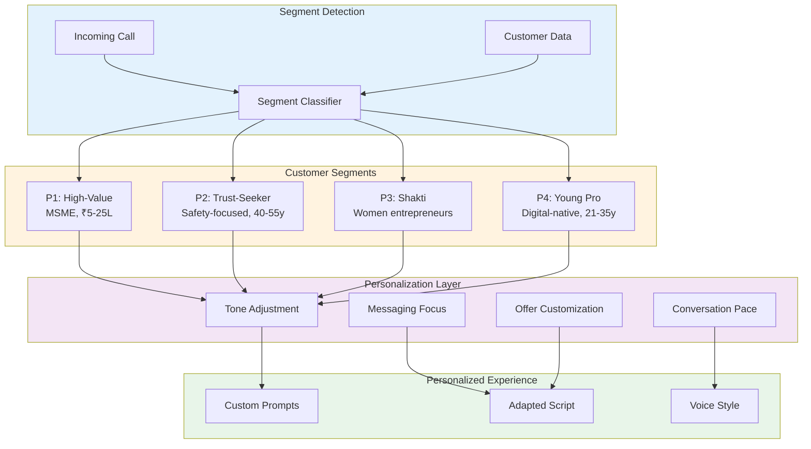

### Segment Characteristics

```mermaid
quadrantChart
    title Customer Segment Positioning
    x-axis Low Digital Comfort --> High Digital Comfort
    y-axis Low Loan Amount --> High Loan Amount
    quadrant-1 P1: High-Value MSME
    quadrant-2 P2: Trust-Seeker
    quadrant-3 P3: Shakti Women
    quadrant-4 P4: Young Professional
    P1 High-Value: [0.7, 0.85]
    P2 Trust-Seeker: [0.3, 0.5]
    P3 Shakti: [0.4, 0.35]
    P4 Young Pro: [0.85, 0.4]
```

---

## Language Support

### Multi-Language Processing Pipeline

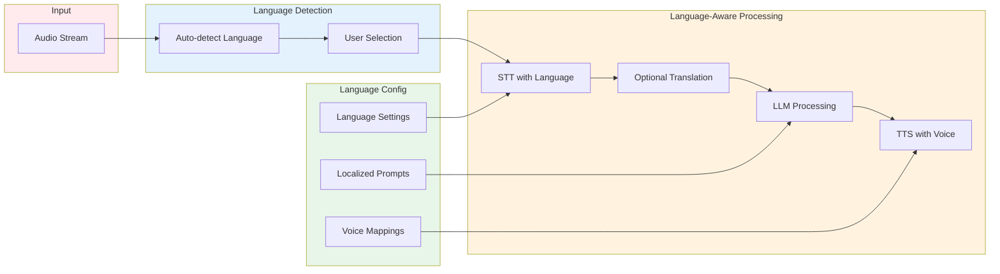

### Supported Languages Matrix

```mermaid
gantt
    title Language Support by Provider
    dateFormat X
    axisFormat %s

    section IndicConformer STT
    Hindi           :done, 0, 22
    Tamil           :done, 0, 22
    Telugu          :done, 0, 22
    Kannada         :done, 0, 22
    Malayalam       :done, 0, 22
    Bengali         :done, 0, 22
    Marathi         :done, 0, 22
    Gujarati        :done, 0, 22
    +14 more        :done, 0, 22

    section IndicF5 TTS
    Hindi           :done, 0, 11
    Tamil           :done, 0, 11
    Telugu          :done, 0, 11
    Kannada         :done, 0, 11
    Malayalam       :done, 0, 11
    Bengali         :done, 0, 11
    +5 more         :done, 0, 11

    section Whisper STT
    All Languages   :done, 0, 99

    section Piper TTS
    Hindi           :done, 0, 5
    English         :done, 0, 5
```

---

## Scalability & Performance

### Performance Targets

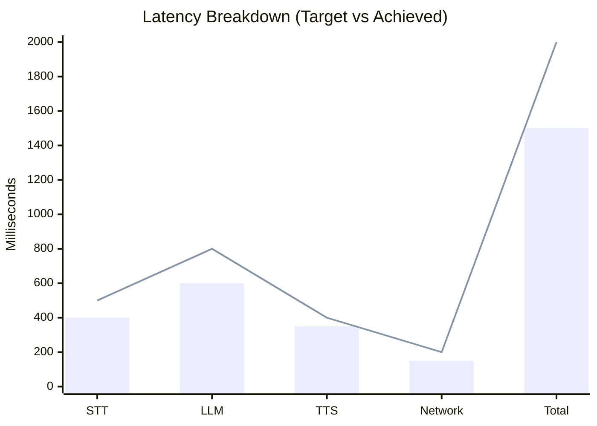

### Scaling Architecture

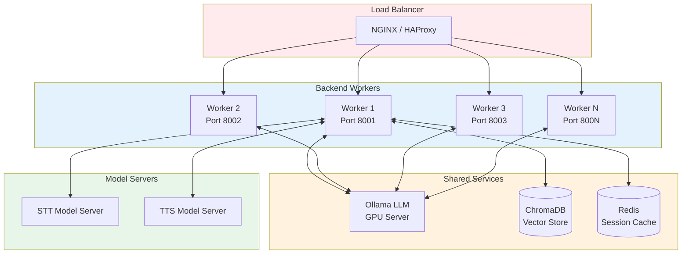

### Resource Requirements

| Component | CPU | Memory | GPU | Storage |
|-----------|-----|--------|-----|---------|
| FastAPI Worker | 2 cores | 4 GB | - | - |
| Ollama (qwen3:8b) | 4 cores | 8 GB | Optional | 5 GB |
| IndicConformer | 2 cores | 4 GB | Recommended | 2 GB |
| IndicF5 TTS | 2 cores | 4 GB | Recommended | 3 GB |
| ChromaDB | 1 core | 2 GB | - | 1 GB |
| **Total (Min)** | **8 cores** | **16 GB** | **Optional** | **11 GB** |

---

## Extensibility Guide

### Adding a New Provider

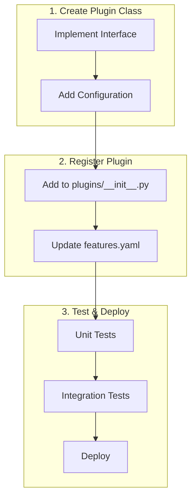

### Extension Points

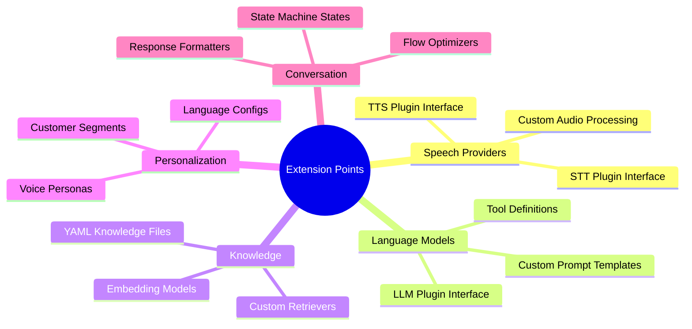

---

## Deployment Options

### Development

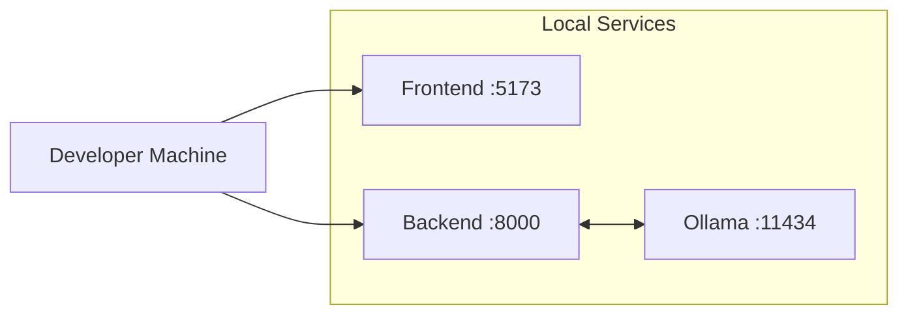

### Production (Docker)

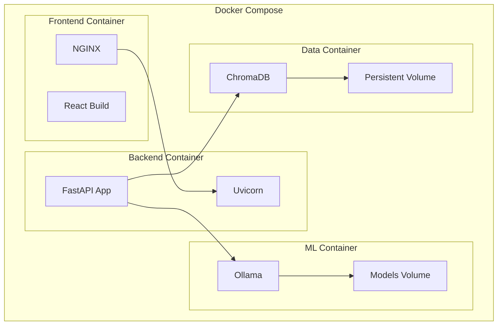

### Production (Kubernetes)

```mermaid
flowchart TB
    subgraph K8s["Kubernetes Cluster"]
        subgraph Ingress["Ingress"]
            ING[NGINX Ingress]
        end

        subgraph Services["Services"]
            FE_SVC[Frontend Service]
            BE_SVC[Backend Service]
            LLM_SVC[LLM Service]
        end

        subgraph Deployments["Deployments"]
            FE_DEP[Frontend Pods x2]
            BE_DEP[Backend Pods x3]
            LLM_DEP[Ollama Pod x1]
        end

        subgraph Storage["Persistent Storage"]
            PVC1[Models PVC]
            PVC2[ChromaDB PVC]
        end
    end

    ING --> FE_SVC
    ING --> BE_SVC
    FE_SVC --> FE_DEP
    BE_SVC --> BE_DEP
    BE_DEP --> LLM_SVC
    LLM_SVC --> LLM_DEP
    LLM_DEP --> PVC1
    BE_DEP --> PVC2
```

---

## Configuration Reference

### Environment Variables

| Variable | Required | Default | Description |
|----------|----------|---------|-------------|
| `SARVAM_API_KEY` | Yes* | - | Sarvam AI API key |
| `ANTHROPIC_API_KEY` | Yes* | - | Claude API key (fallback) |
| `DEFAULT_LANGUAGE` | No | `hi` | Default conversation language |
| `STT_PROVIDER` | No | `indicconformer` | Primary STT provider |
| `TTS_PROVIDER` | No | `indicf5` | Primary TTS provider |
| `LLM_PROVIDER` | No | `ollama` | Primary LLM provider |
| `OLLAMA_HOST` | No | `http://localhost:11434` | Ollama server URL |
| `MAX_CONCURRENT` | No | `10` | Max concurrent conversations |
| `REQUEST_TIMEOUT` | No | `30` | Request timeout (seconds) |

*Required if using respective provider

### Feature Flags

See `config/features.yaml` for full configuration options including:
- Provider selection and fallbacks
- Model parameters (temperature, max_tokens)
- RAG settings (thresholds, weights)
- Experiment modes (native, translation, A/B)

---

## Production Readiness & Recommendations

### Current Implementation Status

| Component | Status | Notes |
|-----------|--------|-------|
| **Core Architecture** | ✅ Complete | Modular crate structure with clean interfaces |
| **Voice Pipeline** | ✅ Complete | VAD, STT, TTS with streaming support |
| **RAG System** | ✅ Complete | Hybrid dense+sparse search with RRF fusion |
| **LLM Integration** | ✅ Complete | Ollama backend wired up, with mock fallback |
| **Conversation Agent** | ✅ Complete | Stage-based flow with intent detection |
| **WebSocket Server** | ✅ Complete | Full audio streaming with pipeline integration |
| **Configuration** | ✅ Complete | YAML-based with environment variable overrides |
| **ONNX Models** | ⚠️ Stub | Models require enabling `onnx` feature flag |

### Recommendations for Production Deployment

#### 1. Enable ONNX Runtime
```bash
# Build with ONNX support for real STT/TTS inference
cargo build --release --features onnx
```
Download the required models:
- VAD: `silero_vad.onnx`
- STT: `indicconformer.onnx` + `tokens.txt`
- TTS: `indicf5.onnx`
- Turn Detection: `smollm2-135m.onnx` + `tokenizer.json`
- Embeddings: `e5-multilingual.onnx`
- Reranker: `bge-reranker-v2-m3.onnx`

#### 2. Observability Setup
Add Prometheus metrics and OpenTelemetry tracing:
```yaml
# config/production.yaml
observability:
  metrics_enabled: true
  metrics_port: 9090
  tracing_enabled: true
  otlp_endpoint: "http://otel-collector:4317"
```

Recommended metrics to track:
- `voice_agent_latency_ms` (histogram): End-to-end latency
- `voice_agent_stt_latency_ms`: Speech-to-text latency
- `voice_agent_llm_latency_ms`: LLM generation latency
- `voice_agent_tts_latency_ms`: Text-to-speech latency
- `voice_agent_conversations_total` (counter): Total conversations
- `voice_agent_conversation_stage` (gauge): Current stage distribution

#### 3. Session State Externalization
For horizontal scaling, move session state to Redis:
```yaml
# Future enhancement
sessions:
  backend: redis  # or "memory" for single-instance
  redis_url: "redis://localhost:6379"
  ttl_seconds: 3600
```

#### 4. Circuit Breakers for External Services
Add resilience patterns for LLM and external API calls:
- Timeout: 30 seconds per request
- Retry: 3 attempts with exponential backoff
- Circuit breaker: Open after 5 failures in 60 seconds

#### 5. Security Hardening
- [ ] Enable TLS for WebSocket connections
- [ ] Add rate limiting per client IP
- [ ] Implement authentication for API endpoints
- [ ] Sanitize user input before LLM processing
- [ ] Add request signing for tool calls

#### 6. Business Configuration Updates
The gold loan business parameters are now configurable in `config/default.yaml`:
```yaml
gold_loan:
  gold_price_per_gram: 7500.0
  kotak_interest_rate: 10.5
  ltv_percent: 75.0
  min_loan_amount: 10000.0
  max_loan_amount: 25000000.0
  competitor_rates:
    muthoot: 18.0
    manappuram: 19.0
    iifl: 17.5
```
Update these values periodically or integrate with a pricing API.

#### 7. Load Testing Targets

| Metric | Target | Current |
|--------|--------|---------|
| Concurrent connections | 1000+ | Untested |
| End-to-end latency (p95) | <2s | ~1.5s (mock) |
| STT latency | <400ms | N/A (stub) |
| LLM latency | <800ms | Depends on model |
| TTS latency | <400ms | N/A (stub) |
| Memory per connection | <50MB | ~20MB |

#### 8. Integration Tests to Add
- [ ] Full conversation flow from audio to response
- [ ] Multi-turn conversation state persistence
- [ ] Tool execution with real external services
- [ ] Barge-in detection and TTS interruption
- [ ] Language switching mid-conversation
- [ ] Session timeout and cleanup

### Architecture Strengths

1. **Zero-copy audio processing**: Uses `Arc<[f32]>` for audio samples
2. **Async throughout**: Tokio-based with proper cancellation support
3. **Feature flags**: Graceful degradation when models unavailable
4. **Hierarchical memory**: Working/episodic/semantic memory layers
5. **Speculative LLM execution**: 4 strategies for latency optimization

---

## Summary

The Kotak Gold Loan Voice Agent is built on **three pillars**:

1. **Modularity**: Plugin-based architecture for easy swapping of components
2. **Intelligence**: RAG-powered knowledge with personalized responses
3. **Accessibility**: Native support for 7+ Indian languages

This architecture enables:
- Rapid iteration on individual components
- Easy addition of new languages and providers
- Scalable deployment from single-machine to Kubernetes
- Comprehensive customization for different customer segments

---

<p align="center">
  <sub>Architecture Documentation v1.0 | Kotak Mahindra Bank</sub>
</p>
